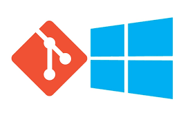

# Aos usuários de Windows

Diferentemente dos computadores que utilizam Mac OS ou alguma distribuição(flavor) Linux, o terminal não é tão equivalente ao prompt de comando ou o Windows PowerShell (presentes no seu PC)

Sendo assim, vamos utilizar um "emulador" do terminal chamado Git Bash. Como ele já é instalado por padrão ao instalarmos o Git para o Windows, isso vai facilitar muito a nossa vida, então, siga os passos bem simples abaixo:

- Certifique-se de sua conexão à internet e acesse o site do instalador [Git for Windows](https://gitforwindows.org/)

- Faça o download da versão correspondente ao seu sistema operacional (normalmente, os computadores recentes, incluindo, muito provavelmente, o seu, são de 64-bit)
    - Para sistemas 32-bit, o arquivo a ser baixado terá um nome parecido com **Git-XXX-32-bit.exe**
    - Para sistemas 64-bit (provavelmente o caso), o arquivo a ser baixado terá um nome parecido com **Git-XXX-64-bit.exe**

- Ao terminar o download, execute o arquivo baixado e instale **mantendo as opções padrão** (a menos que você já saiba o que está fazendo)

Agora que você já tem o Git e o Git Bash instalados, você já pode voltar para a página anterior, em que vamos brincar um pouco com o terminal.

[Voltar para o tópico anterior](./top1_terminal.md)